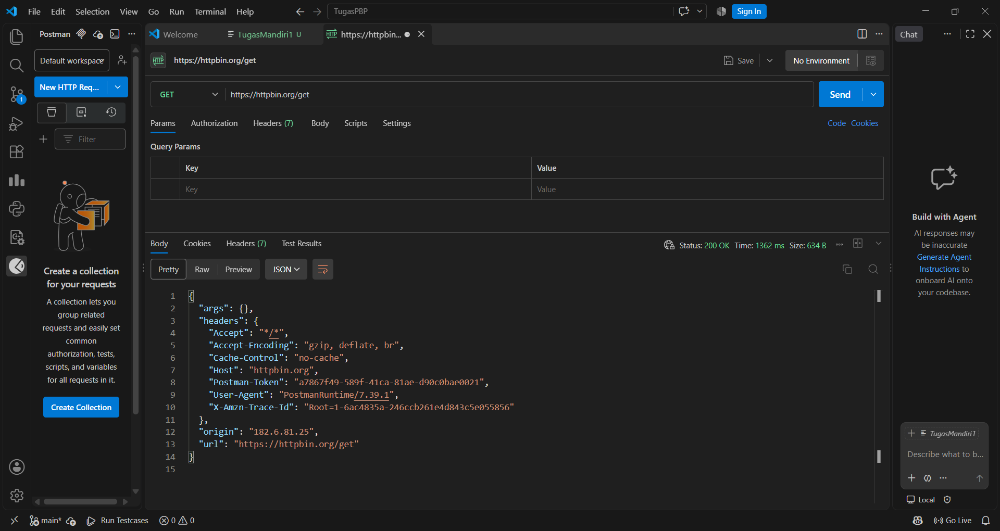
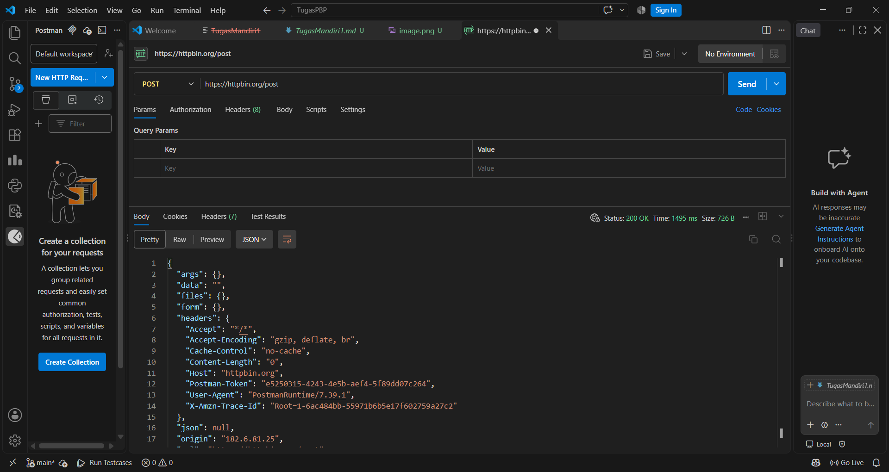
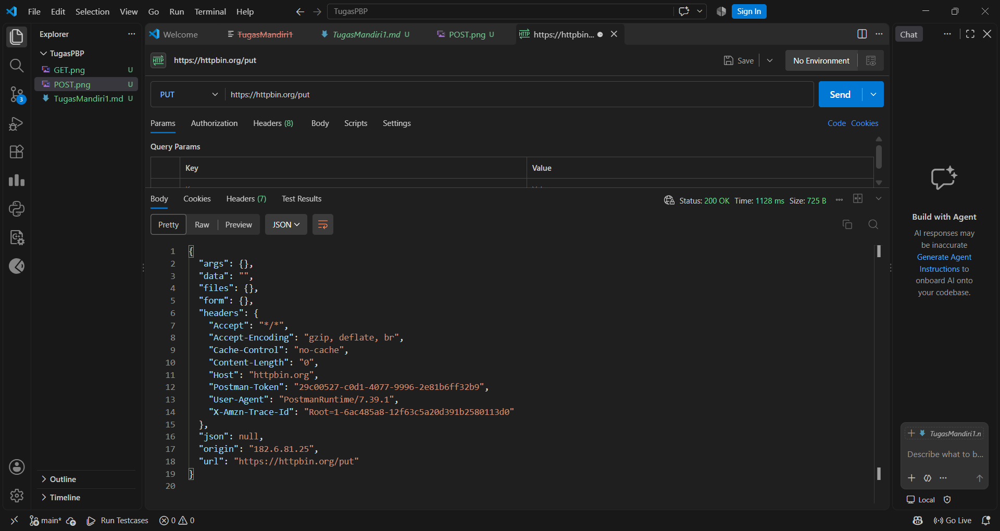
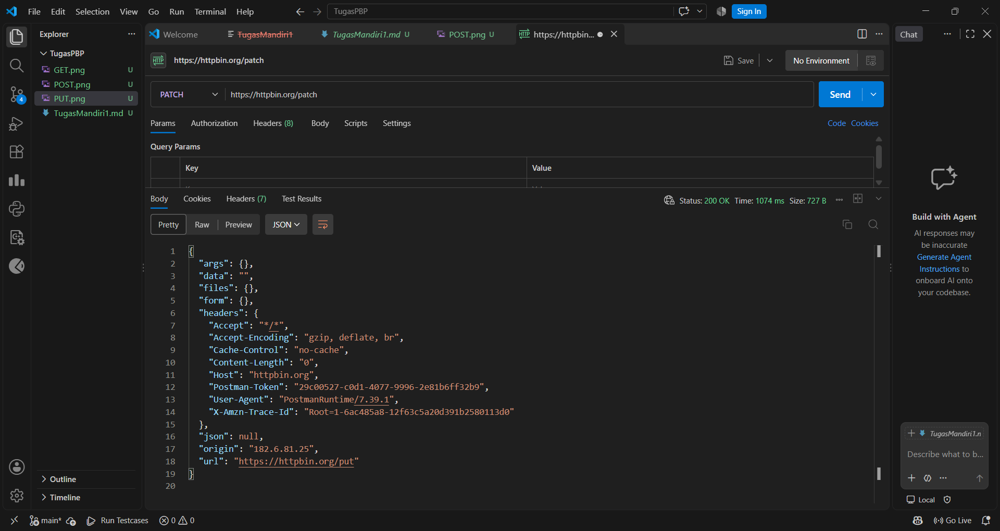
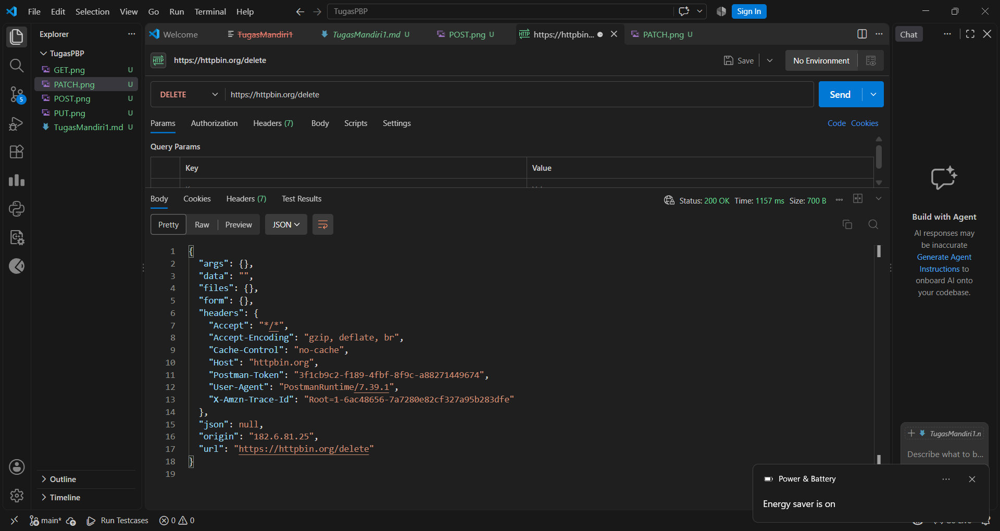

| No | Method | Endpoint | Data yang Dikirim | Status | Hasil |
|----|--------|----------|-------------------|--------|-------|
| 1 | GET | `/get` | Query parameter | 200 | Berhasil mengambil data |
| 2 | POST | `/post` | JSON/body | 200 | Berhasil mengirim data |
| 3 | PUT | `/put` | JSON/body | 200 | Berhasil memperbarui data |
| 4 | PATCH | `/patch` | JSON/body | 200 | Berhasil mengubah sebagian data |
| 5 | DELETE | `/delete` | - | 200 | Berhasil menghapus data |

## Screenshot hasil percobaan

