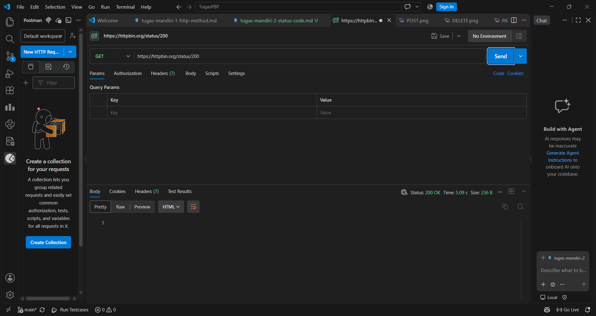
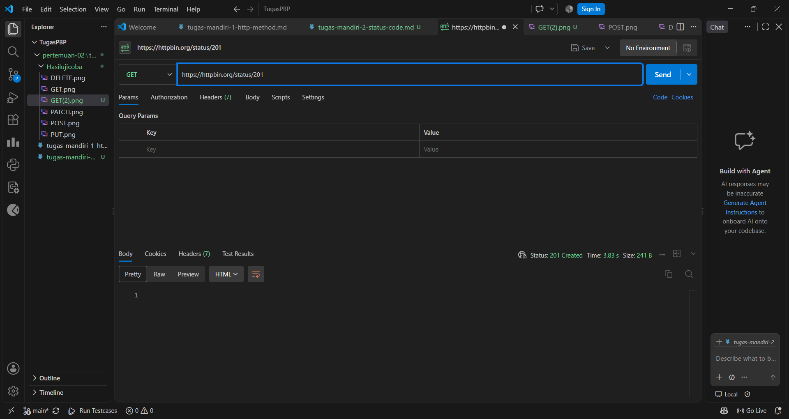
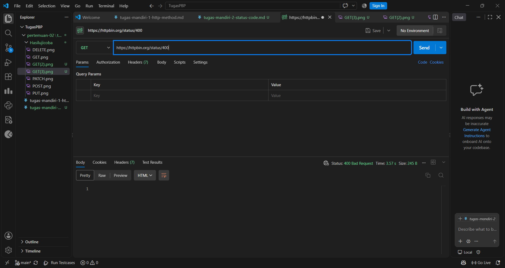
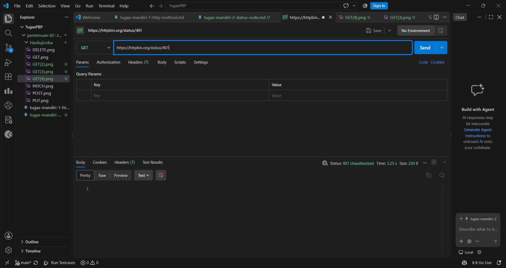
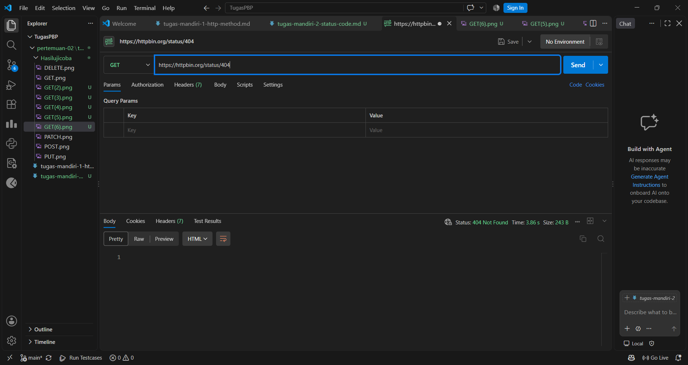
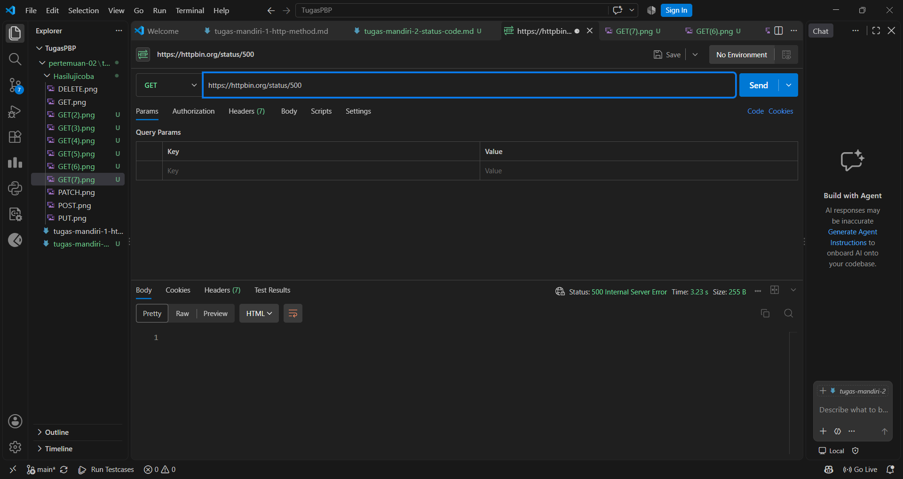

1. Apa perbedaan 400 dan 404?

400 Bad Request: servernya ditemukan, tetapi isi request-nya salah atau tidak bisa dipahami. Contohnya JSON tidak valid atau parameter wajib tidak dikirim.
404 Not Found: request-nya mungkin valid secara format, tetapi resource di URL tersebut tidak ada. Contohnya /users/9999 padahal user itu tidak ada.

Singkatnya, 400 berarti cara meminta-nya yang salah, sedangkan 404 berarti yang diminta tidak ada.

2. Apa perbedaan 401 dan 403?

401 Unauthorized: masalah autentikasi. Server belum tahu siapa Anda, misalnya karena belum login atau token salah atau kedaluwarsa. Solusinya adalah login atau mengirim kredensial yang benar.
403 Forbidden: masalah otorisasi. Server tahu siapa Anda, tetapi Anda tidak berhak mengakses resource itu. Login ulang tidak akan membantu, karena yang perlu diubah adalah hak aksesnya.

Analogi: 401 seperti belum menunjukkan kartu identitas di pintu masuk gedung. 403 seperti sudah menunjukkan kartu, tetapi kartu Anda tidak berlaku untuk ruangan tertentu.

3. Mengapa 500 menunjukkan masalah pada sisi server?
Kode 5xx berarti request dari klien sudah diterima dan secara format tampak benar, tetapi server gagal memprosesnya. Penyebabnya ada di internal server, seperti bug pada kode, database yang tidak bisa dihubungi, konfigurasi salah, atau exception yang tidak ditangani. Klien tidak bisa memperbaikinya dengan mengubah request, karena pihak yang harus memperbaiki adalah developer atau administrator server.

4. Apakah semua error HTTP berarti server mengalami kerusakan?
Tidak. Error HTTP dibagi dua kelompok:

4xx (client error): kesalahan ada di sisi klien, seperti URL salah (404), data tidak valid (400), belum login (401), atau tidak punya izin (403). Server justru bekerja dengan benar karena menolak request yang memang tidak seharusnya diterima.
5xx (server error): baru di sini server yang bermasalah, misalnya 500, 502, 503, atau 504.

Jadi 404 atau 403 bukan tanda server rusak, melainkan tanda server berfungsi dan menjawab bahwa request tidak bisa dipenuhi.

## Screenshot hasil percobaan mandiri 2

