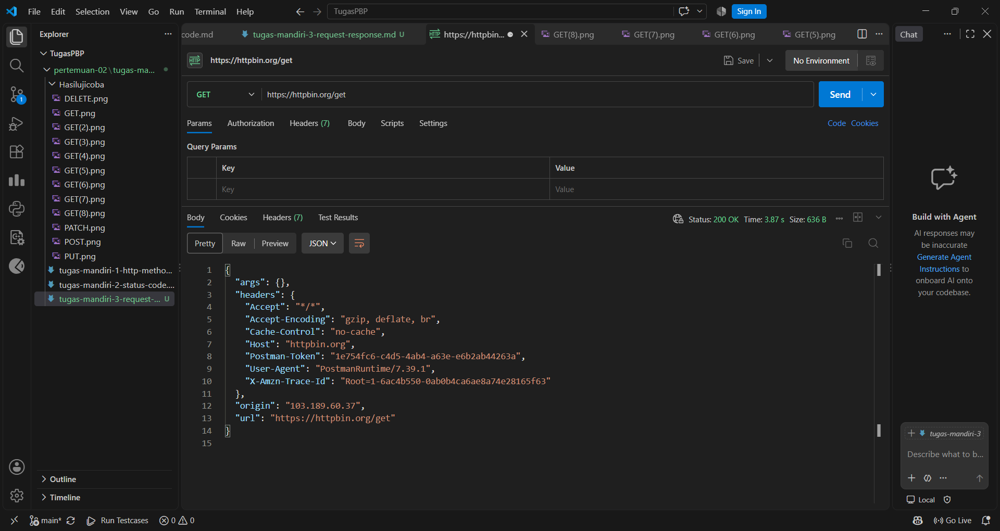
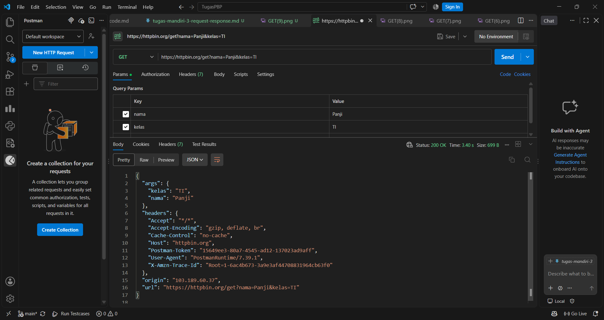
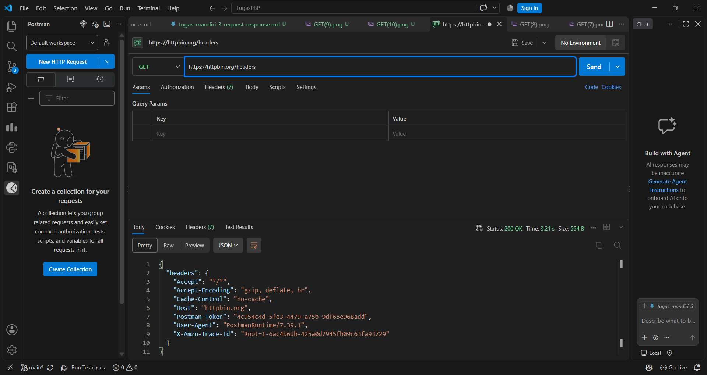

1. Apa yang dimaksud request?

Request adalah permintaan yang dikirim oleh client (misalnya browser, curl, atau Postman) kepada server. Request terdiri dari method yang menyatakan jenis aksi seperti GET atau POST, URL yang menunjukkan resource yang dituju, header yang berisi informasi tambahan tentang request, dan terkadang body yang berisi data yang dikirim. Pada pengujian GET https://httpbin.org/get?nama=Panji&kelas=TI, request-nya adalah permintaan GET ke alamat tersebut beserta dua query parameter.

2. Apa yang dimaksud response?

Response adalah jawaban yang dikirim server kepada client setelah memproses request. Response terdiri dari status code seperti 200 atau 404 yang menunjukkan hasil pemrosesan, header yang berisi informasi tentang respons seperti jenis konten, dan body yang berisi data yang diminta, misalnya JSON, HTML, atau gambar. Pada HTTPBin, body response berisi kembali informasi request yang diterima server, sehingga kita bisa melihat apa yang sebenarnya sampai ke server.

3. Apa fungsi query parameter?

Query parameter adalah pasangan key dan value yang ditulis setelah tanda tanya pada URL dan dipisahkan dengan tanda &, misalnya ?nama=Panji&kelas=TI. Fungsinya untuk mengirim data tambahan kepada server, biasanya untuk mencari, memfilter, mengurutkan, atau membagi data per halaman. Pada HTTPBin, parameter yang dikirim akan tampil kembali di bagian args pada response, yaitu nama bernilai Umar dan kelas bernilai TI.

4. Apa fungsi HTTP header?

HTTP header adalah metadata berbentuk pasangan nama dan nilai yang menyertai request maupun response. Header tidak termasuk data utama, tetapi memberi tahu pihak penerima bagaimana data harus diperlakukan. Contohnya User-Agent yang menunjukkan aplikasi atau browser pengirim, Accept yang menyatakan format respons yang diinginkan, Authorization yang membawa token atau kredensial, dan Content-Type yang menyatakan format data pada body. Endpoint /headers memperlihatkan header apa saja yang diterima server, dan di sana terlihat bahwa client mengirim lebih banyak header daripada yang kita tulis sendiri, karena sebagian dikirim otomatis oleh browser atau tool yang dipakai.

5. Apa perbedaan data pada URL dengan data pada request body?

Data pada URL ditulis langsung di alamat setelah tanda tanya, sehingga terlihat jelas di address bar, tersimpan di riwayat browser, dan tercatat di log server. Panjangnya juga terbatas, dan umumnya dipakai pada method GET untuk keperluan seperti pencarian dan filter. Karena mudah terlihat, data ini tidak cocok untuk informasi sensitif seperti password atau token.

Data pada request body dikirim di dalam isi request dan terpisah dari URL, sehingga tidak muncul di address bar atau riwayat browser. Ukurannya bisa jauh lebih besar, termasuk untuk upload file, dan umumnya dipakai pada method POST, PUT, atau PATCH untuk keperluan seperti form login, pendaftaran, dan pengiriman JSON. Namun perlu diingat bahwa body tidak otomatis aman. Tanpa HTTPS, isinya tetap bisa dibaca orang yang menyadap jaringan, jadi data sensitif tetap harus dikirim lewat koneksi HTTPS.

## Screenshot hasil percobaan mandiri 3

