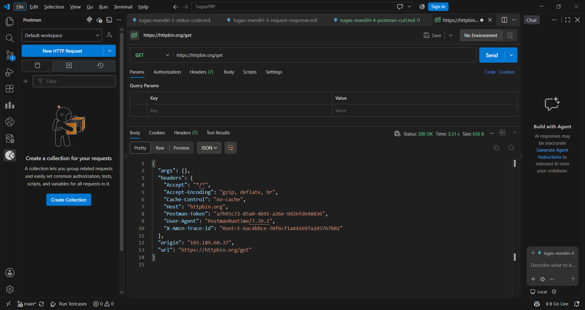
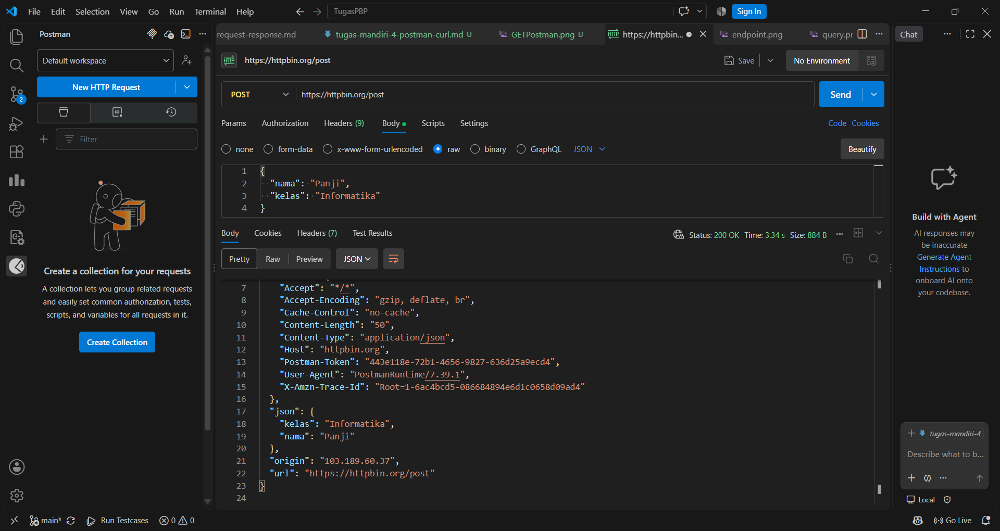
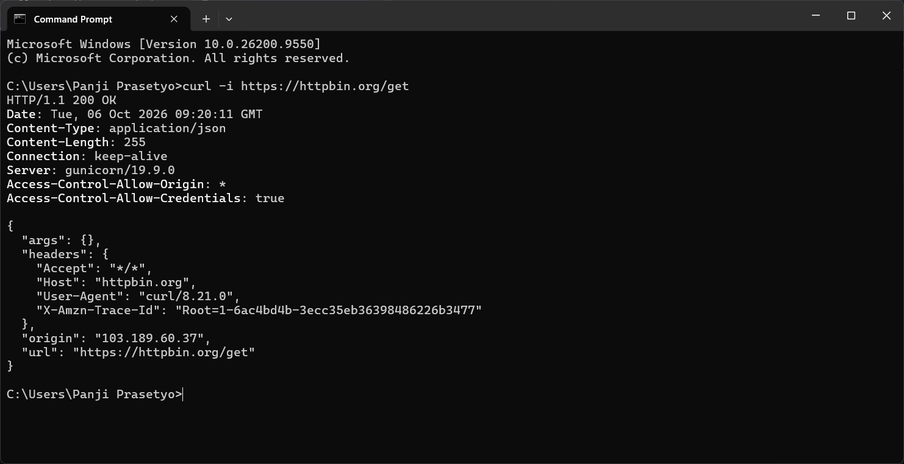
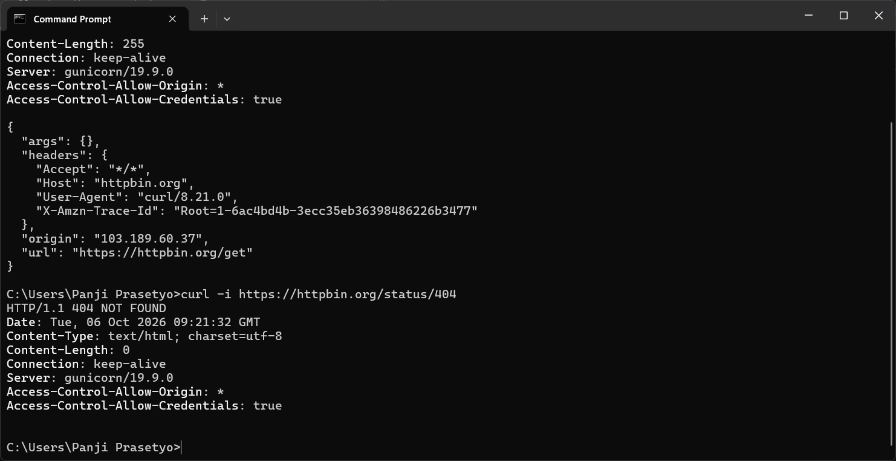
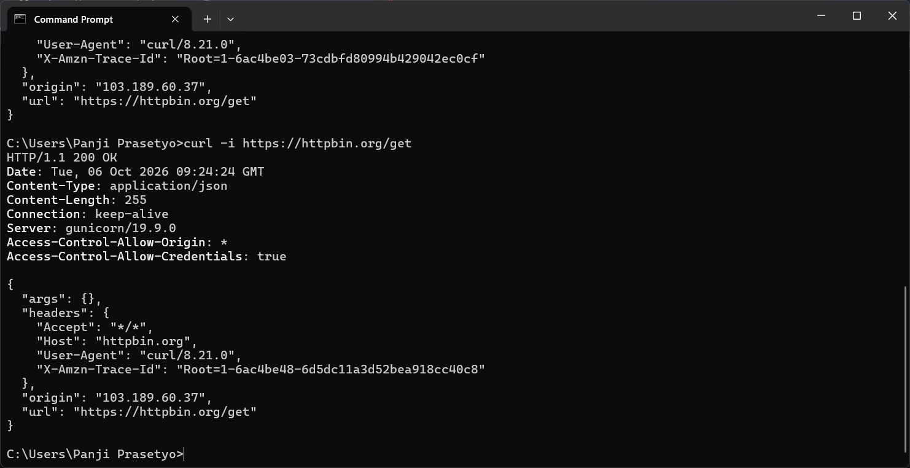
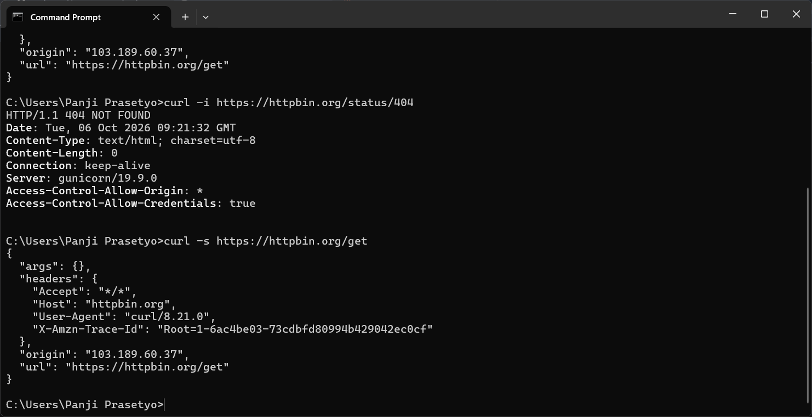

Perbedaan hasil kedua perintah: curl -s hanya menampilkan body respons (JSON-nya saja), sedangkan curl -i menampilkan baris status dan header respons terlebih dahulu, baru kemudian body.
Fungsi opsi -s: -s (silent) menyembunyikan progress bar dan pesan error tambahan dari curl, sehingga outputnya bersih dan hanya berisi data.
Fungsi opsi -i: -i (include) menyertakan header respons di dalam output, sehingga status code, Content-Type, Content-Length, dan header lainnya ikut terlihat.
Kapan digunakan: Gunakan -s ketika hanya butuh datanya, misalnya saat output diteruskan ke program lain (curl -s ... | jq) atau disimpan ke file. Gunakan -i ketika menguji atau men-debug API dan perlu memeriksa status code serta header, misalnya untuk mencari tahu mengapa request gagal.

## Screenshot hasil percobaan mandiri 4

