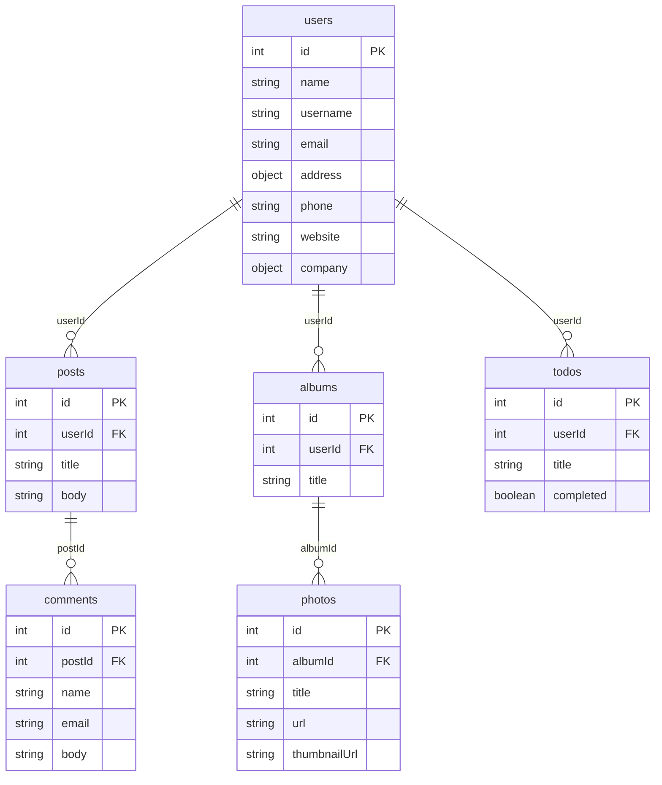

# Analisis JSONPlaceholder

Struktur data, relasi, method HTTP, dan status code.

---

## 1. Perbandingan `/posts/1` dan `/users/1`

**`/posts/1`** (data sederhana, flat):

```json
{ "userId": 1, "id": 1, "title": "...", "body": "..." }
```

**`/users/1`** (data kompleks, nested):

```json
{
  "id": 1, "name": "Leanne Graham", "username": "Bret",
  "email": "Sincere@april.biz",
  "address": { "street": "...", "suite": "...", "city": "...",
               "zipcode": "...", "geo": { "lat": "...", "lng": "..." } },
  "phone": "...", "website": "...",
  "company": { "name": "...", "catchPhrase": "...", "bs": "..." }
}
```

| Aspek | `/posts/1` | `/users/1` |
|---|---|---|
| Jumlah field | 4 | 8 field utama, plus objek bersarang |
| Struktur | Flat | Nested (`address`, `address.geo`, `company`) |
| `id` | Pengenal unik post | Pengenal unik user |
| `userId` | Ada, sebagai foreign key penunjuk penulis | Tidak ada, karena user adalah entitas induk |
| Field konten | `title` (judul) dan `body` (isi) | Tidak ada |
| Field identitas | Tidak ada | `name`, `username`, `email`, `phone`, `website` |
| Lokasi dan organisasi | Tidak ada | `address` (alamat dan koordinat `geo`), `company` |

### Fungsi field

- `id` mengidentifikasi data secara unik dan menjadi primary key.
- `userId` menghubungkan post ke pemiliknya.
- `title` dan `body` adalah konten tulisan.
- `name`, `username`, `email`, `phone`, `website` adalah profil kontak user.
- `address` dan `geo` menyimpan lokasi dan koordinat.
- `company` menyimpan data perusahaan tempat user bekerja.

Singkatnya, **post adalah data transaksional/konten** yang merujuk ke pemiliknya, sedangkan **user adalah data master/profil** yang berdiri sendiri.

---

## 2. Struktur Tabel dan Diagram Relasi

- **`/posts`** (100 data): `id` (PK), `userId` (FK → users.id), `title`, `body`.
- **`/users`** (10 data): `id` (PK), `name`, `username`, `email`, `address{}`, `phone`, `website`, `company{}`.

Resource lain di JSONPlaceholder ikut melengkapi relasinya:



Versi teks (untuk viewer yang tidak mendukung Mermaid):

```
users (1) ──< posts (N) ──< comments (N)
  │
  ├──< albums (N) ──< photos (N)
  │
  └──< todos (N)
```

**Relasi utama:** satu user memiliki banyak post (`posts.userId → users.id`), dan satu post memiliki banyak comment (`comments.postId → posts.id`). Relasinya one-to-many, dan `/users` tidak menyimpan daftar post di dalamnya. Penghubungnya hanya foreign key di sisi "banyak".

---

## 3. Hubungan URL, Method, dan Data (contoh `/posts`)

| URL | Method | Arti | Data yang dikembalikan |
|---|---|---|---|
| `/posts` | GET | Ambil seluruh koleksi | Array berisi 100 objek post |
| `/posts/1` | GET | Ambil satu resource berdasarkan id | Satu objek post |
| `/posts/1/comments` | GET | Ambil sub-resource milik post 1 | Array comment dengan `postId = 1` |
| `/posts?userId=1` | GET | Ambil koleksi terfilter | Array post milik user 1 |
| `/posts` | POST | Buat resource baru | Objek yang dikirim ditambah `id: 101` |
| `/posts/1` | PUT | Ganti seluruh resource | Objek baru dengan `id: 1` |
| `/posts/1` | PATCH | Ubah sebagian field | Objek gabungan data lama dan perubahan |
| `/posts/1` | DELETE | Hapus resource | Objek kosong `{}` |

Polanya: **URL menentukan apa yang dituju** (koleksi, item, atau sub-resource), **method menentukan aksi** yang dilakukan, dan **bentuk data respons mengikuti keduanya**. URL koleksi menghasilkan array, URL item menghasilkan objek tunggal.

---

## 4. `/posts/1` vs `?userId=1`

| Aspek | `/posts/1` | `/posts?userId=1` |
|---|---|---|
| Jenis parameter | Path parameter | Query parameter |
| Yang dicari | Post dengan **`id` = 1** | Semua post dengan **`userId` = 1** |
| Bentuk hasil | **Objek tunggal** `{...}` | **Array** `[{...}, ...]` |
| Jumlah hasil | Tepat 1 | 10 post (id 1-10) |
| Jika tidak ditemukan | `404` dengan body `{}` | `200` dengan array kosong `[]` |
| Fungsi | Mengakses satu resource spesifik | Memfilter koleksi |

Kuncinya: `id` adalah identitas unik post, sedangkan `userId` adalah atribut yang dimiliki banyak post. Karena itu hasilnya objek tunggal pada yang pertama dan array pada yang kedua. Untuk satu post yang diketahui id-nya, gunakan `/posts/1`. Untuk semua post milik satu user, gunakan `?userId=1`.

---

## 5. Perbandingan GET, POST, PUT, PATCH, DELETE

| Method | Contoh | Status code | Hasil yang dikembalikan | Perubahan data |
|---|---|---|---|---|
| **GET** | `/posts/1` | `200 OK` | Data post yang diminta | Tidak ada (hanya baca) |
| **POST** | `/posts` | `201 Created` | Data yang dikirim, plus `id: 101` | Membuat data baru |
| **PUT** | `/posts/1` | `200 OK` | Objek pengganti dengan `id: 1` | Mengganti seluruh data. Field yang tidak dikirim hilang. |
| **PATCH** | `/posts/1` | `200 OK` | Objek lengkap dengan field yang diubah | Hanya mengubah field yang dikirim |
| **DELETE** | `/posts/1` | `200 OK` | `{}` | Menghapus data |
